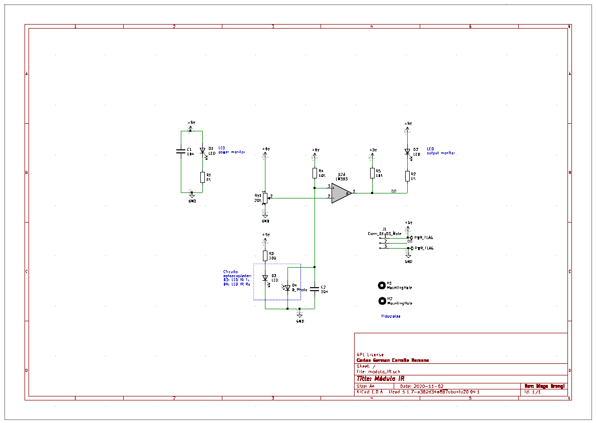

# Diseño de Circuitos Impresos

Trabajo práctico final

CESE 2020

**Autor**: Carlos German Carreño Romano

**Revisor**: Diego Brengi

| Fecha      | Versión | Descripción                          | Autor               |
| ---------- | ------- | ------------------------------------ | ------------------- |
| 2020-11-06 | 1.1     | Informe técnico del diseño propuesto | Carlos G. C. Romano |
|            |         |                                      |                     |

[TOC]

### Módulo comercial

### Esquemático disponible

### Circuito esquemático

### Circuito impreso PCB

### Modelo 3D

